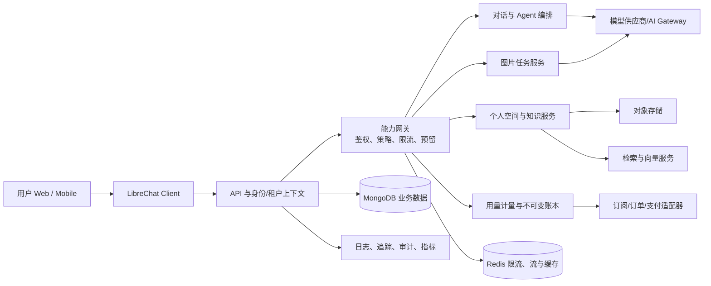

# 基于 LibreChat 的自营 AI 业务评估与实施清单

> **目的**：把当前 LibreChat 从“可配置的 AI 对话平台”建设为可长期运营的自营 AI 服务。目标用户可在一个账户与个人空间中选择受控的 AI 能力，包括对话、图片生成、文件与知识数据、个人数据空间，以及后续的数据系统与自动化能力。
>
> **评估边界**：本文基于仓库当前代码、示例配置和容器编排进行静态评估；不替代法务、等保/隐私、支付资质、云厂商容量或模型供应商合同审查。本文中“已有”表示仓库存在实现或可配置入口，不代表生产环境已经启用或满足商业 SLA。

## 1. 结论与建议

### 1.1 结论

LibreChat 适合作为第一阶段的**用户工作台、模型路由层与 Agent 工具层**：已有多模型端点、流式对话、图片生成、文件上传与检索、记忆、项目、搜索、认证、角色/组、租户隔离、余额记录、对象存储、Redis 横向扩展和可观测性等基础。用它先验证“统一入口 + 多能力套餐”的产品假设，能明显缩短从零到 MVP 的周期。

但它不是完整的商业 AI 平台底座。以下能力应作为自营业务层明确补齐，而不应只依赖现有聊天配置：

1. **商业闭环**：商品、订阅、订单、支付回调、发票/退款、权益发放、可审计账本与对账。
2. **能力治理**：产品化能力目录、套餐/组织/用户授权、模型与工具策略、限额、并发、计费口径、灰度和熔断。
3. **数据产品**：个人空间中的文件、数据集、知识库、连接器、版本、保留/删除、导入导出与数据权限；“能上传文件”不等于“数据系统”。
4. **生产运营**：供应商抽象与故障切换、成本归因、配额防透支、内容安全、审计、备份恢复、SLO、告警、客服/运营后台。

### 1.2 建议的建设策略

- **先做窄 MVP，再平台化**：首发只承诺“对话 + 图片 + 文件/个人空间 + 基础额度”，用两到三个明确套餐验证留存、毛利和支持成本；不要在首发同时承诺通用数据仓库、低代码自动化、无限 Agent 和任意第三方连接器。
- **把 LibreChat 视为可替换的体验与编排层**：新商业与核心数据域使用独立、版本化的 TypeScript 模块/服务边界；不要把支付、权益和企业数据逻辑堆进 `/api` 的旧 CJS 路由层。
- **先定义“能力—权益—计量—账本”再接支付**：一次请求必须能确定用户/租户、能力、模型或工具、输入输出计量、价格版本、扣费结果和可追踪请求 ID。
- **默认最小权限与隔离**：个人空间、文件、检索索引、对象存储键、日志和分析数据都以 `tenantId + owner/principal` 为访问边界；对高风险工具（代码执行、外部 MCP、联网）实行显式授权与审批。

## 2. 当前项目能力盘点

| 目标能力            | 当前基础                                                                               | 评估                                      | 商业化前的关键补齐                                                        |
| ------------------- | -------------------------------------------------------------------------------------- | ----------------------------------------- | ------------------------------------------------------------------------- |
| 基本 AI 对话        | 多供应商与自定义兼容端点、流式响应、会话导入导出、搜索、语音                           | **可直接作为 MVP 核心**                   | 模型白名单、路由/降级、每套餐限制、成本与体验指标                         |
| 图片生成/编辑       | GPT Image、DALL-E、Stable Diffusion、Flux 与 MCP 方式                                  | **可作为受控增值能力**                    | 任务队列、幂等、图片内容安全、单独的像素/张数计量、成品保留策略           |
| 文件、知识与检索    | 上传、文件搜索、RAG API + pgvector、对象存储策略                                       | **基础较好，但不是完整数据产品**          | 数据集/知识库领域模型、连接器、版本与来源、索引状态、删除级联、配额与费用 |
| 个人空间            | 用户、对话、项目、记忆、文件模型及访问控制                                             | **可承载“个人工作区”第一版**              | 空间首页、资源目录、容量统计、分享/回收站、明确的数据生命周期             |
| Agent、工具、自动化 | Agents、Skills、MCP、代码执行、后台任务/计划能力                                       | **有差异化潜力，风险较高**                | 工具准入、租户级凭据隔离、预算、审批、任务状态机、重试/死信与审计         |
| 多用户/组织         | 邮箱、OAuth2、LDAP，角色、组、ACL、租户字段                                            | **具备组织版基础**                        | 商业组织、成员席位、域名验证、SCIM/SAML（按市场需要）、租户运营模型       |
| 额度/用量           | balance、transactions、token spend 与请求保留额度                                      | **能用于内测/简单预付费，不等于计费系统** | 不可变双分录账本、价格版本、支付订单、退款/补偿、供应商账单对账           |
| 运维与可观测        | Docker Compose、MongoDB、Meilisearch、pgvector/RAG、Redis 可选、OpenTelemetry/Langfuse | **开发和早期生产可用**                    | IaC、托管数据库、备份演练、SLO、告警、审计留存、容量和灾备                |

### 2.1 可复用的仓库资产

- `client` 是 React 单页应用；`api` 是 Express 接线层；新的后端行为应放入 `packages/api`；共享 API 类型与数据访问位于 `packages/data-provider`；数据库模型、迁移和数据方法在 `packages/data-schemas`。这条边界非常适合把自营业务模块逐步加在正确层次。
- MongoDB 承载业务对象，Meilisearch 用于检索，RAG 服务使用 pgvector；部署编排已展示 API、MongoDB、搜索、向量库和 RAG 服务的依赖关系。
- 文件存储支持 local、S3、Firebase、Azure Blob 和 CloudFront 策略；生产环境应选定对象存储并使用私有对象、签名下载/受控 CDN，而不是容器本地 `uploads`。
- `tenantId` 已存在于多类业务对象且数据层有租户隔离机制；这应成为自营业务的强制设计前提，而不是后期迁移项。
- 已有余额预留与交易记录相关模型；可复用其“请求在飞时预留额度”的思想，但不应把它直接当作支付总账。

### 2.2 重要限制和风险

1. **上游迭代风险**：当前代码包含试验性 Agent/附属工作区能力。生产承诺要以锁定版本、回归套件和特性开关为准，不能以 README 功能列表为 SLA。
2. **费用失控风险**：模型流式输出、工具调用、图片任务、检索与代码执行都有可变成本。仅在响应结束后扣费会被并发和中断放大，必须在准入时预授权/预留，完成后按真实计量结算并释放差额。
3. **数据与隐私风险**：对话、上传文件、记忆、日志和追踪均可能含个人或商业敏感信息。需单独定义数据分类、处理目的、地域、保留期、删除证明和供应商数据条款。
4. **工具执行风险**：MCP、联网、代码执行、外部 OAuth 凭据均可能造成数据外发或越权。默认关闭高风险能力，按租户与用户授予，要求工具级审计和出站网络控制。
5. **可用性风险**：单机 Compose 适合开发/演示而非长期业务。Mongo、Redis、搜索、向量库、对象存储和模型供应商任一故障都应有降级、重试边界和用户可理解的状态。

## 3. 目标业务与技术蓝图

### 3.1 产品边界（建议首发）

| 层       | 首发提供                                                                | 暂不承诺/后置                                            |
| -------- | ----------------------------------------------------------------------- | -------------------------------------------------------- |
| 用户体验 | 注册登录、对话、模型选择、图片创作、文件上传、会话与个人空间            | 通用协作套件、复杂工作流市场、任意第三方数据连接器       |
| 能力目录 | `chat`、`image.generate`、`file.store`、`knowledge.search` 四类受控能力 | 默认开放代码执行、任意 MCP、无限后台 Agent               |
| 商业模式 | 免费试用 + 预付费额度或两档订阅；明确有效期、容量和公平使用规则         | 多币种税务、企业合同计费、渠道分成（在订单和账本稳定后） |
| 客户对象 | 个人与小团队；组织空间作为第二阶段                                      | 高合规行业/跨地域数据驻留承诺（完成合规评估后）          |

### 3.2 参考架构

**核心原则**：请求经过能力网关才可调用供应商；供应商原始价格、产品价格和实际用量分别保存；支付系统通过适配器进入账本；业务读模型可重建，账本与审计记录不可被普通更新覆盖。

### 3.3 建议的领域边界

| 领域               | 职责                                           | 关键实体                                                             |
| ------------------ | ---------------------------------------------- | -------------------------------------------------------------------- |
| Identity & Tenant  | 用户、组织、成员、角色、会话和数据隔离         | `tenant`、`membership`、`principal`                                  |
| Capability Catalog | 能力定义、可用模型/工具、风险等级、开关与版本  | `capability`、`policy`、`entitlement`                                |
| Metering & Ledger  | 请求计量、预留、结算、调整和对账               | `usage_event`、`credit_reservation`、`ledger_entry`、`price_version` |
| Commerce           | 套餐、订单、订阅、支付回调、退款和发票状态     | `product`、`subscription`、`order`、`payment_event`                  |
| Workspace & Data   | 个人空间、文件、数据集、知识库、索引和分享     | `workspace`、`asset`、`dataset`、`knowledge_base`                    |
| AI Execution       | 模型路由、任务状态、工具执行和供应商降级       | `execution_request`、`generation_job`、`provider_route`              |
| Trust & Operations | 审计、内容安全、风控、告警、运营配置和客服动作 | `audit_event`、`moderation_case`、`feature_flag`                     |

## 4. 分阶段实施路线图

> 时间以“完成顺序”而非日历承诺表达。每阶段只有在退出标准满足后才进入下一阶段。

### 阶段 0：立项与生产基线

**目标**：在开放用户前明确业务边界、责任人、供应商和安全底线。

- [ ] 确定首发地区、目标用户、允许的模型供应商、支付渠道和数据处理地域。
- [ ] 编写产品条款、隐私政策、可接受使用政策、内容投诉与申诉流程；配置到界面链接和注册同意流程。
- [ ] 建立数据分级：账户资料、对话、文件、支付元数据、运行日志、审计日志；为每类指定保留期、加密、访问者和删除流程。
- [ ] 选择生产托管 MongoDB、Redis、对象存储、搜索/向量服务和密钥管理；禁止把开发 Compose 卷作为生产持久化方案。
- [ ] 定义 SLO：登录、首 token、完整回答、图片任务、文件上传、检索、支付回调；设置错误预算、告警和事故响应责任人。
- [ ] 创建环境分层（dev/staging/prod）、最小权限 IAM、密钥轮换、CI/CD、数据库迁移和回滚策略。
- [ ] 为所有外部供应商配置预算、速率、地域、数据不用于训练（如适用）和故障联系人。

**退出标准**：威胁建模完成；生产依赖和备份方案经演练；可在 staging 跟踪一次请求的用户、租户、能力、成本和审计链路。

### 阶段 1：可收费 MVP（对话、图片、个人空间）

**目标**：让受邀用户可以安全使用并付费，且运营方能控制成本。

- [ ] 在 `packages/data-provider` 定义能力、用量事件、权益、价格版本和账本的共享契约；避免在客户端复制计费类型。
- [ ] 在 `packages/data-schemas` 实现租户安全的数据模型、索引、迁移和数据访问方法；所有公开签名使用普通类型而非 Mongoose 文档类型。
- [ ] 在 `packages/api` 实现注入式能力网关：加载已认证主体和租户、检查权益/策略、原子预留额度、执行、记录用量、结算/释放额度。
- [ ] 仅在 `/api` 增加路由注册和请求接线；不把价格计算、支付验证或业务分支写进 CJS 路由。
- [ ] 定义首发能力及每项限制：可用模型、每分钟请求数、并发数、每日/周期额度、最大输入/输出、图片尺寸/张数、文件类型/单文件大小/总容量。
- [ ] 建立个人空间最小模型：空间、文件/资源列表、容量计数、来源与创建时间、下载、删除和回收期；对象键必须携带租户和主体边界。
- [ ] 为图片生成建立异步任务状态（已接受、执行中、成功、失败、取消、过期），支持幂等键与断线后查询；不要只依赖浏览器连接状态。
- [ ] 接入一个支付渠道的适配器，验证 webhook 签名和事件幂等；订单支付成功后仅由服务端写入账本/权益。
- [ ] 上线账户与用量页：当前套餐、余额/周期额度、能力限制、消耗明细、失败原因、充值/订阅入口和支持入口。
- [ ] 启用登录保护、注册防滥用、API/生成/上传限流、内容审核、文件病毒扫描（接入后）和审计事件。

**退出标准**：从支付成功到权益可用可重复验证；并发请求不会超卖额度；用户可看见用量；管理员可对单次使用、订单和账本条目完成对账；删除个人文件后原对象与检索副本按策略清理。

### 阶段 2：组织、知识与运营闭环

**目标**：支持小团队和可运营的知识数据服务。

- [ ] 引入组织、成员、邀请、席位和组织工作区；明确个人资源与组织资源的归属、转移和离职处理。
- [ ] 将“文件搜索”升级为知识库：数据集、文档版本、解析/切片/索引状态、失败重试、来源引用、重建和删除级联。
- [ ] 增加受控数据导入：首选 CSV/XLSX/PDF/文本；连接器采用逐个审批和最小只读 OAuth 范围，不在首版开放任意数据库直连。
- [ ] 为共享、下载、外链、导出设置权限、有效期、水印/审计（按业务需要）和管理员撤销。
- [ ] 建立运营后台：用户/组织支持、人工额度调整（双人复核或原因码）、风控封禁、内容申诉、订单/支付事件查询、配置变更审计。
- [ ] 建立成本中心：按租户、套餐、能力、模型、供应商、地区统计收入、成本、毛利、失败率和滥用率。
- [ ] 完成备份恢复与删除演练：账户导出、删除请求、索引重建、对象恢复、Mongo 恢复和灾难演练均有可验证记录。

**退出标准**：组织成员无法跨租户读取资源；知识库在上传、解析失败、重试、删除和恢复后保持一致；运营人员不需要直接修改数据库即可处理常见支持与额度问题。

### 阶段 3：差异化能力与规模化

**目标**：在成本、安全和可靠性已验证后扩展 Agent、自动化和数据系统。

- [ ] 增加能力市场/目录与功能开关，按套餐、地区、租户和灰度组启用模型、工具、MCP 和实验功能。
- [ ] 将 Agent 和外部工具置于独立执行队列/隔离环境，提供网络 egress allowlist、凭据代理、超时、并发、预算、人工审批、取消、重试和死信队列。
- [ ] 在真实使用数据上实现模型路由：质量/延迟/成本策略，供应商健康检查，允许的降级路径和用户可见的失败说明。
- [ ] 为数据系统提供 API、审计、数据集版本、任务调度和连接器治理；对任何写操作工具强制范围约束和可追踪审批。
- [ ] 按目标市场补齐企业能力：SAML/SCIM、域名验证、数据驻留、客户管理密钥、合规报告和合同化 SLA。

**退出标准**：高风险能力可被独立关闭且不影响核心对话；供应商故障有经演练的降级；按租户可导出完整审计、用量和数据生命周期记录。

## 5. 核心实施清单

### 5.1 计费、权益与支付（上线阻断项）

- [ ] 统一单位：分别定义 token、图片、存储 GB·天、检索/解析、工具 CPU/时长等计量单位，禁止把不同成本都折算为未说明含义的“积分”。
- [ ] 每条 `usage_event` 至少记录：请求 ID、幂等键、用户、租户、能力、模型/供应商、价格版本、计量输入、时间、状态与关联账本条目。
- [ ] 设计不可变账本：充值、赠送、预留、结算、释放、退款、人工调整均为追加条目；余额只是由账本派生或受严格事务保护的读模型。
- [ ] 支付 webhook 做签名校验、原始事件持久化、去重、顺序无关处理和可重放；不接受客户端报告的支付结果或金额。
- [ ] 对流式与异步任务在执行前预留最坏可接受额度，在完成/取消/超时时结算并释放；预留须有 TTL 和后台清理。
- [ ] 建立供应商成本导入与日对账；监控“用户收费 < 供应商成本”“未结算预留”“无关联账本用量”等异常。
- [ ] 明确退款、赠送额度、过期、套餐降级和欠费行为，并在产品条款和界面中可见。

### 5.2 安全、隐私与合规（上线阻断项）

- [ ] 所有资源请求从认证上下文获取主体和租户，绝不信任请求体中的用户/租户 ID；对对象存储、向量检索、搜索索引和缓存键使用同一隔离语义。
- [ ] 按能力建立授权矩阵：谁能使用模型、上传、共享、导出、联网、MCP、代码执行和管理员调整额度。
- [ ] 对外部 URL、网页抓取、文件解析、图片生成提示词和工具参数分别执行输入验证、SSRF 防护、内容审核和大小/时间限制。
- [ ] 加密传输、数据库与对象存储；通过密钥管理系统注入并轮换供应商密钥、Cookie/JWT 密钥和支付密钥；日志绝不记录密钥或原始敏感文件内容。
- [ ] 实现数据主体请求：导出、删除、撤回共享、账户注销；删除任务覆盖主数据、对象、缓存、向量、搜索索引和可删除的追踪数据。
- [ ] 为管理员、账本、支付、权限、导出、分享和高风险工具操作写不可抵赖审计事件，并配置保留与访问控制。
- [ ] 发布前做依赖/镜像扫描、SAST、渗透测试、越权测试、上传恶意样本测试和支付 webhook 伪造测试。

### 5.3 可靠性与可观测性

- [ ] 为对话、图片、上传、索引和支付实现明确状态机；客户端可恢复展示加载、成功、失败、取消、重试和恢复会话。
- [ ] 设置全链路 correlation/request ID；追踪从用户、能力网关到供应商和账本，但对追踪字段进行脱敏与白名单控制。
- [ ] 建立指标：活跃用户、转化、留存、首 token、成功率、P95 延迟、供应商错误、队列积压、额度拒绝、毛利、投诉与违规率。
- [ ] 对模型、支付、对象存储、向量服务分别配置超时、有限重试、熔断、退避和降级；禁止无界重试。
- [ ] Redis 用于跨实例限流、流恢复和短期状态时，配置高可用、键 TTL、故障策略与容量告警；关键账本不能只存 Redis。
- [ ] 对 Mongo、对象存储、索引、向量库执行定期备份、恢复验证和容量压测；记录 RPO/RTO。

### 5.4 交付、测试与发布

- [ ] 为新增业务契约写单元测试；为租户隔离、预留/结算、支付重放、退款和删除级联写集成测试。
- [ ] 对对话、图片、文件和用量页面写端到端测试，覆盖登录、无额度、成功、供应商失败、取消、重试和刷新恢复。
- [ ] 改动 `packages/api`、`packages/data-schemas` 或 `packages/data-provider` 时，分别运行工作区 `npx tsc --noEmit`；构建不替代类型检查。
- [ ] 涉及启动、认证、配置、文件或消息加载时运行 `npm run lighthouse`，关注首屏可见会话和数据库串行读取预算。
- [ ] 以 feature flag、小流量灰度、可回滚迁移和版本化价格发布；先内部员工、再受邀用户、最后逐步放量。
- [ ] 每次发布记录：配置版本、数据库迁移、价格版本、模型可用列表、回滚步骤、负责人和监控看板链接。

## 6. 优先级、责任与验收

| 优先级 | 工作包                                   | 建议主责      | 关键验收                                               |
| ------ | ---------------------------------------- | ------------- | ------------------------------------------------------ |
| P0     | 生产身份、租户、对象存储、备份和监控基线 | 平台/安全     | 跨租户访问测试失败；恢复演练成功；关键告警到人         |
| P0     | 能力网关、额度预留、用量与不可变账本     | 后端/商业     | 并发不超卖；可按请求对账；异常可补偿                   |
| P0     | 对话、图片、空间与用量体验               | 产品/前端     | 关键状态可见；限额和失败说明清楚；可访问性与本地化达标 |
| P0     | 支付适配器、webhook、订单与客服查询      | 商业后端/运营 | 重放安全；支付到权益延迟受控；人工不改库处理常见问题   |
| P1     | 知识库、索引生命周期和组织空间           | 数据/后端     | 上传至检索可观测；删除无残留；成员权限正确             |
| P1     | 内容安全、风控、审计和申诉               | 安全/运营     | 高风险动作可追溯；策略可配置；申诉可闭环               |
| P1     | 模型路由、成本看板、供应商降级           | AI 平台/SRE   | 成本可归因；供应商故障按策略降级                       |
| P2     | Agent/MCP/代码执行与自动化               | AI 平台/安全  | 沙箱、审批、预算、取消、审计和失效凭据全部可测         |
| P2     | 企业身份与合规能力                       | 企业产品/安全 | 符合目标客户合同和地域要求                             |

## 7. 首次执行顺序（建议未来 10 个工作日启动）

1. [ ] 召开产品、后端、前端、平台、安全、运营联合设计会，锁定首发能力、目标地区、定价假设、禁止能力和成功指标。
2. [ ] 输出能力/权益/计量/价格四张表，并为每个首发能力指定供应商、成本上限、限额和降级策略。
3. [ ] 完成生产基础设施决策与 staging 环境：托管数据服务、私有对象存储、密钥管理、域名/TLS、监控和备份。
4. [ ] 以 ADR 确认账本模型、支付供应商、个人空间资源模型、数据保留期和租户隔离约束。
5. [ ] 创建 Phase 1 的共享类型、数据迁移、能力网关骨架和 feature flag；先用模拟支付与模拟供应商跑通用量闭环。
6. [ ] 实现对话与图片的预留—执行—结算链路及用户用量页，补齐失败、取消、重试和刷新恢复测试。
7. [ ] 接入真实支付 sandbox，完成 webhook 重放与对账测试；随后邀请内部用户灰度。
8. [ ] 用内部用量数据校准价格、额度和供应商路由，完成隐私/安全发布门禁后再开放外部受邀用户。

## 8. 发布门禁（Go / No-Go）

只有以下问题均回答“是”，才建议公开收费：

- [ ] 是否能在一分钟内定位任一生成请求的租户、用户、能力、供应商、用量、账本和审计记录？
- [ ] 是否能证明任意用户无法通过 API、对象 URL、搜索、向量检索、缓存或分享链接读取另一租户的私有资源？
- [ ] 用户断网、取消、供应商超时、图片失败、支付 webhook 重放时，额度和任务状态是否正确且可解释？
- [ ] 是否已验证备份恢复、账户导出/删除、对象与索引删除级联，以及高风险功能的一键关闭？
- [ ] 是否有 24/7 告警路径、事故负责人、供应商故障降级说明和面向用户的状态页/沟通流程？
- [ ] 是否已由法务/隐私/财务确认面向目标市场的条款、税务、支付和数据处理要求？

## 9. 与本仓库的落地约束

1. 新后端业务逻辑放在 `packages/api`；`api` 只保留 Express 接线、路由注册与调用。
2. 数据模型、迁移、租户安全查询和持久化方法放在 `packages/data-schemas`；共享 HTTP 契约、类型和数据服务放在 `packages/data-provider`。
3. 新的限制、超时、能力或开关需进入 `packages/data-provider/src/config.ts` 的 `configSchema`，以 `librechat.yaml` 提供保留现有行为的默认值。
4. 新服务以依赖注入接收配置、数据方法和供应商客户端；避免读取全局单例，便于测试、替换供应商和未来服务拆分。
5. 前端新增状态采用 Jotai；界面文字走本地化；复用 `@librechat/client` 组件和语义化主题，不在功能中硬编码颜色。
6. 任何用户记录变更都要使认证用户缓存失效；任何商业/数据操作都必须带审计和租户边界测试。

---

## 附录：本次静态评估依据

- 根目录 README 的功能范围包括多模型、Agent/MCP、网页搜索、图片生成、文件、认证、余额/Token spend、管理与可观测性。
- `docker-compose.yml` 显示当前开发/默认编排中的 API、MongoDB、Meilisearch、pgvector 与 RAG API 依赖。
- `librechat.example.yaml` 提供文件存储策略、CloudFront 访问控制、注册方式、余额预留和交易记录配置示例。
- `packages/data-schemas` 已包含余额、交易、文件、记忆、项目、租户和审计相关模型/方法；`packages/api` 已按对话、文件、图片、存储、支付相关余额、MCP、Agent、工具、遥测等领域分目录。

> 下一步应把本文转为带负责人、期限、风险和验收证据的项目看板；在完成 Phase 0 决策前，不建议开始支付或企业数据连接器的正式编码。
